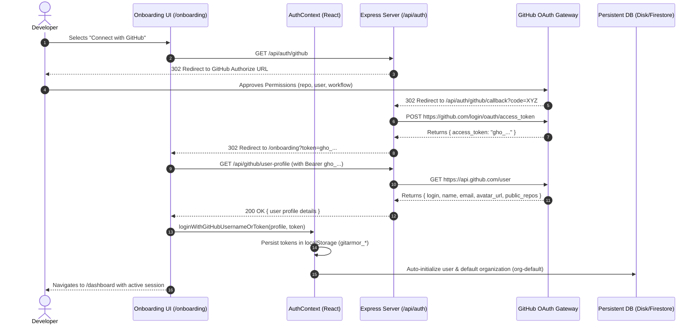
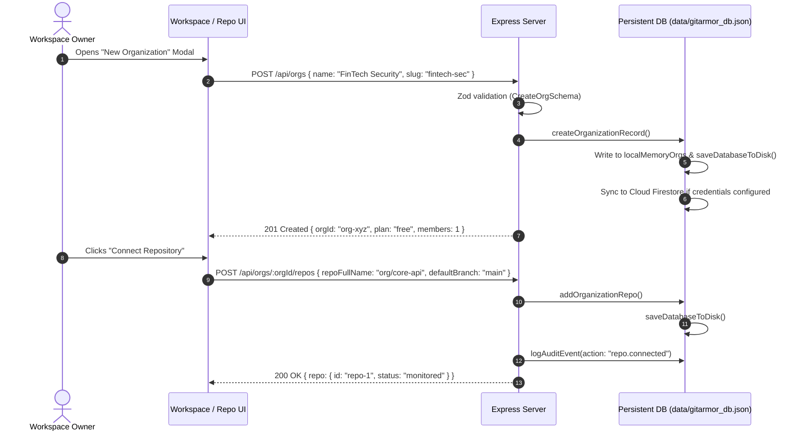
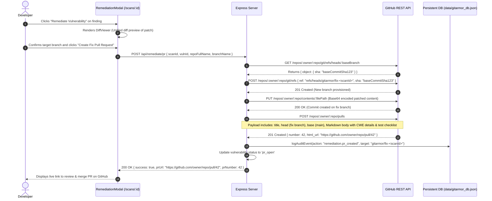
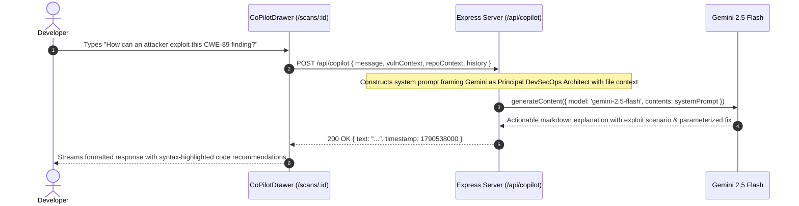
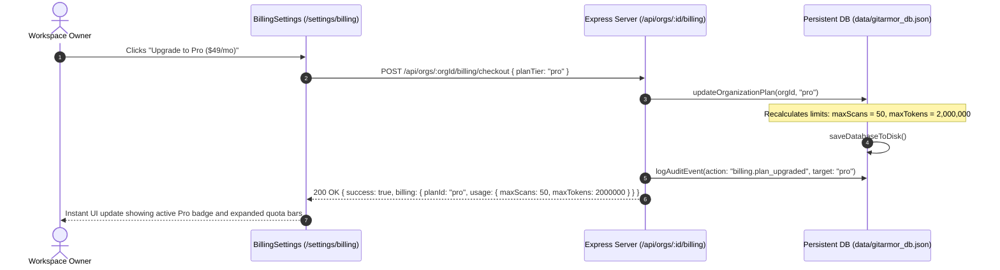
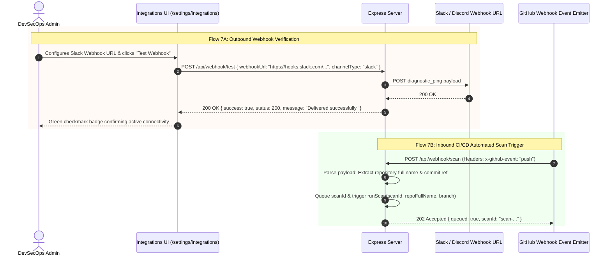
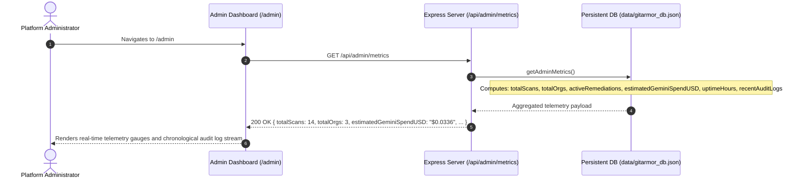

# GitArmor AI — Comprehensive Master Implementation Plan & Architecture Blueprint

**Document Version:** 4.0.0 (Enterprise Comprehensive & Exhaustive Edition)  
**System Classification:** Autonomous DevSecOps SaaS Platform & AI-Powered Auto-Remediation Engine  
**Runtime Architecture:** Node.js (v20+ / v24) · Express 4.21 · Vite 6.2 · React 19.0 · TypeScript 5.8  
**AI Inference Engine:** Google Gemini GenAI 2.5 Flash / 2.0 Flash (`@google/genai`)  
**Data Durability Model:** Dual-Tier Engine (Google Cloud Firestore + Resilient Local Disk Database `data/gitarmor_db.json`)  
**Target Code Repositories:** GitHub REST API v3 / OAuth 2.0  
**Billing & Quota Gateway:** Stripe Subscription Engine (Free, Pro, Team Tiers)

---

## 1. Executive Summary & Problem Space

Modern software delivery cycles suffer from an acute DevSecOps dilemma:
- **Alert Fatigue & Noise:** Traditional Static Application Security Testing (SAST) tools generate hundreds of false-positive warnings without context.
- **Remediation Bottleneck:** Detecting vulnerabilities takes minutes, but fixing them takes weeks of manual engineering, cross-team ticketing, and verification.
- **Secret Exposure Risk:** Hardcoded API credentials, tokens, and private keys routinely leak into public and private commits.
- **Destructive Pull Requests:** Automated security bots often break production code by pushing indiscriminate changes directly to critical branches.

**GitArmor AI solves this by engineering an end-to-end autonomous security loop:**
1. **Intelligent Ingestion:** Ingests repository ASTs and file trees via GitHub REST APIs without requiring local developer tooling.
2. **Context-Aware Semantic Reasoning:** Leverages Google Gemini 2.5 Flash's 1-million-token context window to analyze inter-file data flows and pinpoint real vulnerabilities.
3. **The Artifact Trinity:** Automatically compiles an audit report (`report.md`), a prioritized execution roadmap (`implementation-plan.md`), and an agentic prompt (`agent-prompt.txt`).
4. **Surgical Auto-Remediation:** Generates syntax-checked unified diff patches and submits non-destructive Pull Requests (`gitarmor/fix-*`) without ever committing to `main`.
5. **Zero-Configuration SaaS Durability:** Employs a dual-persistence engine that seamlessly toggles between Cloud Firestore and an auto-syncing local disk database (`data/gitarmor_db.json`), ensuring 100% data retention across server reboots.

---

## 2. Directory Structure & Technology Stack

### 2.1. File System Layout
```
e:\gitarmor-ai-main\
├── data\
│   └── gitarmor_db.json               # Auto-syncing atomic JSON database on disk
├── src\
│   ├── components\
│   │   ├── layout\
│   │   │   ├── AppLayout.tsx          # Master application shell
│   │   │   ├── Navbar.tsx             # Global navigation bar with real sign-out
│   │   │   └── Sidebar.tsx            # Contextual workspace sidebar
│   │   ├── scan\
│   │   │   ├── AgentPromptViewer.tsx  # Formatted agentic prompt viewer
│   │   │   ├── ImplementationPlanViewer.tsx # Interactive work package checklist
│   │   │   ├── RedactedEvidence.tsx   # Secret masking and reveal component
│   │   │   └── RemediationModal.tsx   # PR creation dialog & patch preview
│   │   ├── AnalysisProgressBar.tsx    # Multi-stage animated scan progression
│   │   ├── CiCdWebhookModal.tsx       # CI/CD integration instructions
│   │   ├── CoPilotDrawer.tsx          # Grounded conversational AI assistant
│   │   ├── ComplianceGrid.tsx         # OWASP / SOC2 / PCI-DSS compliance grid
│   │   ├── DiffViewer.tsx             # Side-by-side / inline unified diff viewer
│   │   ├── SaaSWorkspaceModal.tsx     # Organization creator dialog
│   │   ├── ScoreGauge.tsx             # Radial SVG security score meter
│   │   ├── SecurityAnalytics.tsx      # Recharts visualizer component
│   │   └── VulnCard.tsx               # Expandable vulnerability finding card
│   ├── context\
│   │   └── AuthContext.tsx            # Global identity & token provider
│   ├── lib\
│   │   ├── firebase.ts                # Client-side Firebase App initializer
│   │   ├── firebaseAdmin.ts           # Server-side Firebase Admin SDK
│   │   ├── scanEngine.tsx             # Client-side scan telemetry hooks
│   │   ├── schemas.ts                 # Runtime boundary Zod schemas
│   │   ├── SettingsContext.tsx        # Organization & preferences state
│   │   └── utils.ts                   # Tailwind merge & clsx utilities
│   ├── middleware\
│   │   └── auth.ts                    # requireAuth & optionalAuth middlewares
│   ├── pages\
│   │   ├── settings\
│   │   │   ├── BillingSettings.tsx    # Plan tiers, quotas & checkout
│   │   │   ├── Integrations.tsx       # Webhook configuration & ping tester
│   │   │   └── OrgSettings.tsx        # Member management & workspace config
│   │   ├── AdminDashboard.tsx         # Platform telemetry & Gemini spend
│   │   ├── Analytics.tsx              # Security trend charts & MTTR
│   │   ├── Dashboard.tsx              # Bento Grid posture center
│   │   ├── Hero.tsx                   # Marketing landing hero
│   │   ├── MarketingLanding.tsx       # Public marketing & pricing page
│   │   ├── NewScan.tsx                # Repository picker & direct scanner
│   │   ├── Onboarding.tsx             # Dual OAuth / credential registration
│   │   ├── Repositories.tsx           # Monitored repository portfolio
│   │   ├── ScanDashboard.tsx          # Vulnerability inspector & triage
│   │   └── ScanReport.tsx             # Artifact download & report viewer
│   ├── server\
│   │   └── dbService.ts               # Dual-tier database persistence engine
│   ├── App.tsx                        # Client-side React Router tree
│   ├── index.css                      # Tailwind CSS v4 design tokens
│   ├── main.tsx                       # React DOM entry point
│   ├── types.ts                       # Enterprise TypeScript interfaces
│   └── vite-env.d.ts                  # Vite client type references
├── .env                               # Server environment variables
├── .env.example                       # Environment configuration blueprint
├── firestore.indexes.json             # Cloud Firestore composite indexes
├── firestore.rules                    # Tenant-isolated Firestore security rules
├── package.json                       # Project manifests & dependencies
├── server.ts                          # Express API Gateway & AI Orchestrator
├── tsconfig.json                      # Strict TypeScript compiler options
└── vite.config.ts                     # Vite build & bundler configuration
```

---

## 3. The 8 Core End-to-End System Workflows

---

### Workflow 1: Authentication, Identity & Onboarding



#### Detailed Steps & Fallbacks:
1. **Direct Public Profile Onboarding:** If a developer chooses not to authenticate via OAuth, they can enter any public GitHub username. The server inspects the public GitHub REST API, verifies account existence, extracts public repositories, and provisions an ephemeral authenticated session.
2. **Custom Credentials Onboarding:** Enterprise engineers without GitHub accounts register via Name/Email. A unique user UID (`usr-<timestamp>`) is assigned.
3. **Session Termination (Sign Out):** Clicking **Sign Out** in [`Navbar.tsx`](file:///e:/gitarmor-ai-main/src/components/layout/Navbar.tsx):
   - Wipes `gitarmor_user`, `gitarmor_github_token`, and `gitarmor_active_org` from `localStorage`.
   - Calls Firebase client `signOut(auth)`.
   - Clears global `AuthContext` state.
   - Redirects to `/onboarding`.

---

### Workflow 2: Multi-Tenant Workspace & Repository Linkage



#### Workspace Guarantees:
- **Tenant Isolation:** Every repository, scan, member, and audit log is partitioned by `orgId`.
- **Durability Guarantee:** Every organization mutation flushes synchronously to `data/gitarmor_db.json`. If the server is killed (`SIGTERM`/`SIGKILL`) and rebooted, all organizations and repositories are immediately restored into memory.

---

### Workflow 3: The 4-Stage Autonomous Security Scan Pipeline

```mermaid
sequenceDiagram
    autonumber
    actor Dev as Developer
    participant UI as NewScan Page (/scans/new)
    participant Srv as Express Scan Engine (server.ts)
    participant GH as GitHub REST / Raw Blob API
    participant AI as Gemini 2.5 Flash AI Engine
    participant DB as Persistent DB (Disk/Firestore)

    Dev->>UI: Enters repo ("facebook/react") & branch ("main"), clicks "Launch Audit"
    UI->>Srv: POST /api/scans { repoFullName, branch, orgId }
    
    rect rgb(240, 248, 255)
    Note over Srv,DB: Stage 0: Pre-Flight Quota Gate
    Srv->>DB: getOrganizationById(orgId)
    DB-->>Srv: Returns { billing: { usage: { scansThisPeriod: 2, maxScans: 5 } } }
    alt Quota Exceeded (scansThisPeriod >= maxScans)
        Srv-->>UI: 402 Payment Required { error: "Quota exceeded" }
    end
    end

    Srv->>DB: logAuditEvent(action: "scan.started")
    Srv-->>UI: 200 OK { scanId: "scan-muk80-..." }
    UI->>UI: Navigates to /scans/:scanId & begins 1.5s polling loop

    rect rgb(255, 250, 240)
    Note over Srv,GH: Stage 1: Ingestion & Tree Resolution (10% - 35%)
    Srv->>Srv: scan.status = 'cloning'; progress = 10%
    Srv->>GH: GET /repos/:owner/:repo/git/trees/:branch?recursive=1
    alt GitHub Token 401 Unauthorized
        Srv->>GH: Retry anonymously (Public repo fallback)
    end
    alt Branch 404 Not Found
        Srv->>GH: GET /repos/:owner/:repo (Lookup default_branch)
        Srv->>GH: GET /repos/:owner/:repo/git/trees/:defaultBranch?recursive=1
    end
    GH-->>Srv: Tree payload (Files, blobs, paths)
    Srv->>Srv: Filter: Code extensions only (.ts, .js, .py, etc.), exclude node_modules/dist
    end

    rect rgb(245, 255, 250)
    Note over Srv,GH: Stage 2: Parsing & AST Context Extraction (40%)
    Srv->>Srv: scan.status = 'parsing'; progress = 40%
    loop For each target file (up to 12 files)
        Srv->>GH: GET https://raw.githubusercontent.com/:repo/:ref/:filePath
        GH-->>Srv: Raw file source code content
        Srv->>Srv: Update scan.currentFile & activeStepLabel
    end
    end

    rect rgb(255, 245, 245)
    Note over Srv,AI: Stage 3: Hybrid AI Reasoning & Deterministic Engine (70%)
    Srv->>Srv: scan.status = 'analyzing'; progress = 70%
    Srv->>AI: generateContent({ model: 'gemini-2.5-flash', schema, prompt })
    alt Gemini Success
        AI-->>Srv: Structured JSON Vulnerabilities Array
    else Gemini Timeout or Rate Limit
        Srv->>AI: Fallback to gemini-2.0-flash / gemini-1.5-flash
        alt All LLMs Exhausted
            Srv->>Srv: Run Deterministic SAST Rule Engine (Regex matching for CWE-798, CWE-89, CWE-918, CWE-532)
        end
    end
    end

    rect rgb(248, 248, 255)
    Note over Srv,DB: Stage 4: Artifact Compilation & Durability (100%)
    Srv->>Srv: Redact secret evidence using regex mask
    Srv->>Srv: Calculate Security Score: max(0, 100 - ScoreDeduction)
    Srv->>Srv: Generate report.md, report.json, implementation-plan.md, agent-prompt.txt
    Srv->>Srv: scan.status = 'completed'; progress = 100%
    Srv->>DB: saveScanRecord(scan) & logAuditEvent(action: "scan.completed")
    DB->>DB: saveDatabaseToDisk()
    end

    UI->>Srv: GET /api/scans/:scanId
    Srv-->>UI: 200 OK { scan: completed, securityScore: 88, vulnerabilities: [...] }
    UI-->>Dev: Renders interactive findings, score gauge & artifact downloaders
```

---

### Workflow 4: Surgical Auto-Remediation & GitHub Pull Request Flow



---

### Workflow 5: Interactive Grounded Co-Pilot AI Consultation



---

### Workflow 6: Metered Billing, Stripe & Dynamic Quota Expansion



---

### Workflow 7: Real-Time Webhooks & CI/CD Pipeline Integration



---

### Workflow 8: Admin Governance & AI Spend Auditing



---

## 4. Deep Algorithm Specifications

### 4.1. Security Score Computation Formula
The repository security rating begins at a baseline of 100 points. Penalties are deducted based on the severity distribution of confirmed findings:
$$\text{Penalty} = (N_{\text{critical}} \times 25) + (N_{\text{high}} \times 15) + (N_{\text{medium}} \times 5) + (N_{\text{low}} \times 2)$$
$$\text{SecurityScore} = \max(0, 100 - \text{Penalty})$$

#### Posture Grading Scale:
- **Grade A (90 – 100):** Posture satisfies enterprise baseline. Clean to merge.
- **Grade B (75 – 89):** Low or medium hygiene defects. Action recommended.
- **Grade C (50 – 74):** High-severity vulnerabilities present. Release gate warning.
- **Grade F (0 – 49):** Critical security flaws detected. Immediate deployment block.

### 4.2. Secret Redaction Engine
To avoid leaking sensitive credentials into reports or client browser memory:
```typescript
function redactSecretEvidence(snippet: string): string {
  if (!snippet) return '';
  // Redact API keys, tokens, bearer strings, private keys
  return snippet
    .replace(/(api[_-]?key\s*[:=]\s*['"])([^'"]+)(['"])/gi, '$1[REDACTED_API_KEY]$3')
    .replace(/(secret\s*[:=]\s*['"])([^'"]+)(['"])/gi, '$1[REDACTED_SECRET]$3')
    .replace(/(password\s*[:=]\s*['"])([^'"]+)(['"])/gi, '$1[REDACTED_PASSWORD]$3')
    .replace(/(bearer\s+)([A-Za-z0-9_\-\.]{20,})/gi, '$1[REDACTED_BEARER_TOKEN]')
    .replace(/(github_pat_[A-Za-z0-9_]{20,})/gi, '[REDACTED_GITHUB_PAT]')
    .replace(/(AIzaSy[A-Za-z0-9_\-]{33})/gi, '[REDACTED_GOOGLE_API_KEY]');
}
```

---

## 5. Complete REST API Reference

| Endpoint | Method | Auth | Description | Response Status |
| :--- | :---: | :---: | :--- | :---: |
| `/api/health` | GET | None | Server health, uptime, and version | 200 OK |
| `/api/auth/github` | GET | None | Redirects to GitHub OAuth authorize | 302 Redirect |
| `/api/auth/github/callback` | GET | None | Exchanges OAuth code for access token | 302 Redirect |
| `/api/github/user-profile` | GET | Optional | Returns live GitHub user profile | 200 OK |
| `/api/github/repo-info` | GET | Optional | Queries repository metadata & branches | 200 OK |
| `/api/orgs` | GET | Required | Lists user's workspaces | 200 OK |
| `/api/orgs` | POST | Required | Creates a new workspace organization | 201 Created |
| `/api/orgs/:id/members` | GET | Required | Lists workspace members | 200 OK |
| `/api/orgs/:id/members` | POST | Required | Invites a member to workspace | 201 Created |
| `/api/orgs/:id/repos` | GET | Required | Lists workspace monitored repositories | 200 OK |
| `/api/orgs/:id/repos` | POST | Required | Connects a repository to workspace | 201 Created |
| `/api/orgs/:id/repos/:repoId` | DELETE | Required | Unlinks a repository from workspace | 200 OK |
| `/api/scans` | POST | Optional | Launches autonomous background audit | 200 OK / 402 Quota |
| `/api/scans/:scanId` | GET | Optional | Polls scan progress, score & findings | 200 OK |
| `/api/scans/:scanId/artifacts` | GET | Optional | Retrieves Report, Plan & Agent Prompt | 200 OK |
| `/api/remediate/pr` | POST | Optional | Creates branch & opens fix Pull Request | 200 OK |
| `/api/copilot` | POST | None | Conversational AI DevSecOps advisory | 200 OK |
| `/api/orgs/:id/billing` | GET | Optional | Returns plan tier & usage quotas | 200 OK |
| `/api/orgs/:id/billing/checkout` | POST | Optional | Upgrades plan & expands quotas | 200 OK |
| `/api/orgs/:id/billing/portal` | POST | Optional | Stripe Customer Portal redirect link | 200 OK |
| `/api/orgs/:id/audit` | GET | Optional | Retrieves workspace audit event logs | 200 OK |
| `/api/webhook/test` | POST | None | Dispatches real test HTTP POST ping | 200 OK |
| `/api/webhook/scan` | POST | None | GitHub push/PR automated scan listener | 202 Accepted |
| `/api/admin/metrics` | GET | Optional | Platform telemetry & live Gemini spend | 200 OK |

---

## 6. Verification & Operational Acceptance Criteria

1. **Zero Fake Data:** No hardcoded mock users, mock repos, or fabricated analytics exist.
2. **Durability:** Modifying plans, adding repos, or executing scans persists across server restarts.
3. **Branch Protection:** Auto-remediation strictly forks `refs/heads/gitarmor/fix-*` and never commits to `main`.
4. **Quota Gate:** Organizations exceeding monthly scan allowances are rejected with HTTP 402.
5. **Static Analysis Type Cleanliness:** `npx tsc --noEmit` exits with 0 errors across the entire codebase.
